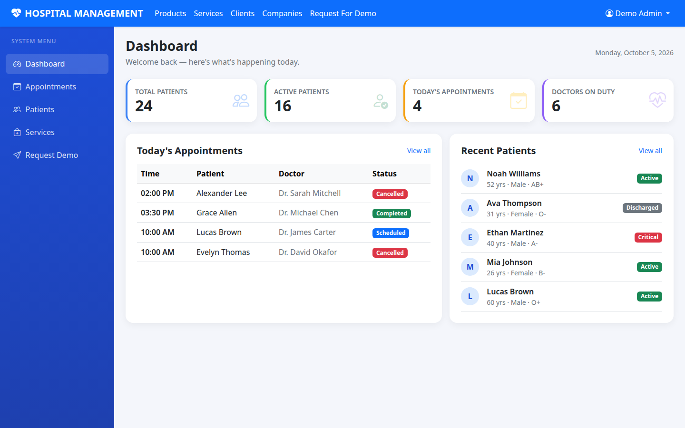
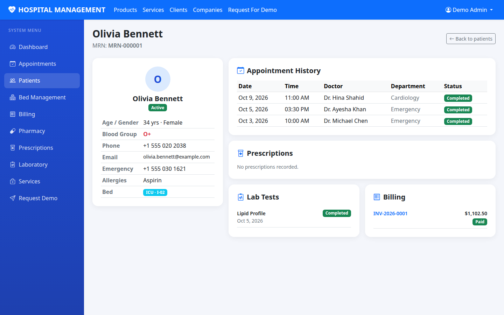
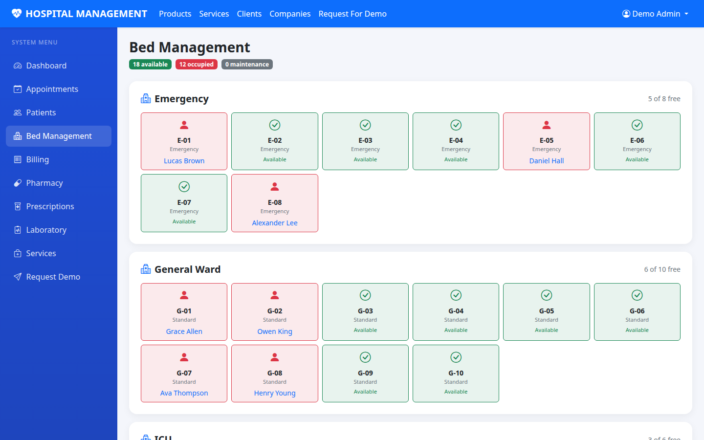
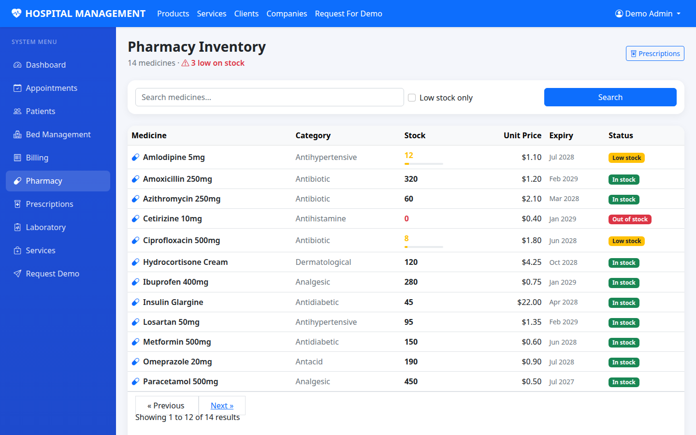
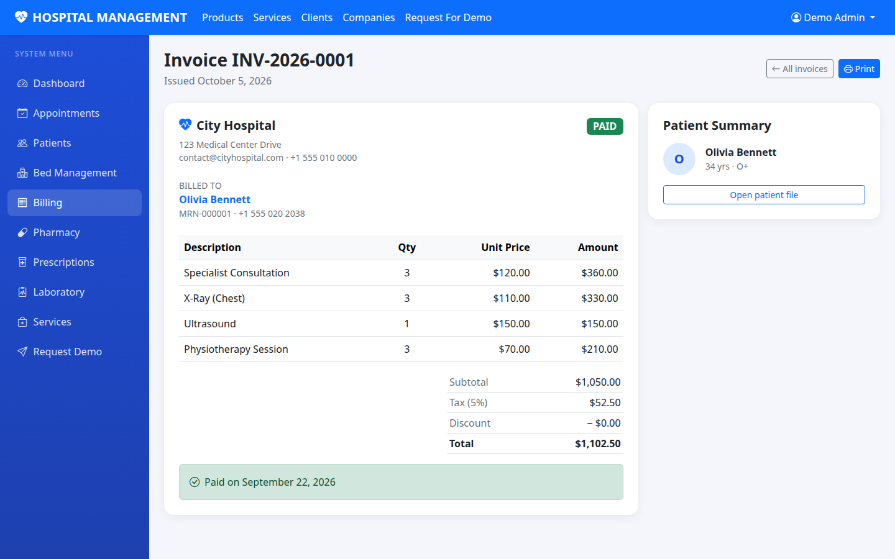
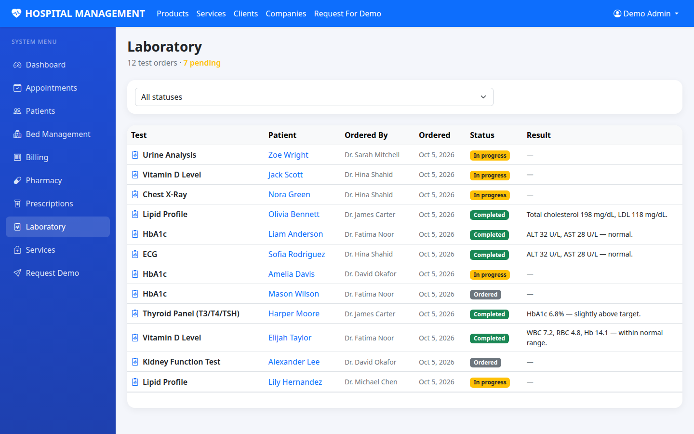

# Hospital Management System


A full-featured hospital management web application built with **Laravel 10**, **MySQL/SQLite**, and **Bootstrap 5**. Manage patient records, schedule appointments across departments, and monitor daily operations from a clean admin dashboard.

> **Live interactive demo:** https://kamran1272.github.io/portfolio/hms-demo/



## Features

- **Admin dashboard** — live stats (patients, appointments, doctors on duty, bed occupancy, pending labs, outstanding bills, monthly revenue), today's appointment list, recent patients
- **Patient management (EHR)** — searchable/filterable patient records with MRN, demographics, blood group, allergies, emergency contacts; full patient file with appointment history, prescriptions, lab tests, and billing
- **Appointment scheduling** — department-wise appointments with date/status filters and pagination
- **Bed management** — visual ward-wise bed matrix (available / occupied / maintenance) with patient assignments
- **Billing** — itemized invoices with tax/discount, payment status tracking, printable invoice view
- **Pharmacy** — medicine inventory with stock levels, low-stock/out-of-stock alerts, expiry tracking
- **Prescriptions** — diagnosis-linked prescriptions with dosage and duration per medicine
- **Laboratory** — test orders with status workflow (ordered → in progress → completed), results with abnormal/critical flags
- **Demo request flow** — working contact form with validation and database storage
- **Auth** — login/registration with a seeded demo account

## Screenshots

| Dashboard | Patient File (EHR) |
|---|---|
|  |  |

| Bed Management | Pharmacy |
|---|---|
|  |  |

| Invoice | Laboratory |
|---|---|
|  |  |

## Tech stack

- Laravel 10 (PHP 8.1+)
- Eloquent ORM with migrations & seeders
- Bootstrap 5 + Bootstrap Icons (no build step required for UI)
- Vite (asset pipeline)

## Quick start (SQLite — zero setup)

```bash
composer install
cp .env.example .env
php artisan key:generate
touch database/database.sqlite   # SQLite demo database (default in .env.example)

php artisan migrate --seed
php artisan serve
```

Then open http://localhost:8000 and log in with:

- Email: `demo@hospital.com`
- Password: `password123`

## Using MySQL

Set in `.env`:

```
DB_CONNECTION=mysql
DB_HOST=127.0.0.1
DB_PORT=3306
DB_DATABASE=hospital
DB_USERNAME=root
DB_PASSWORD=
```

Then run `php artisan migrate --seed`.

## Project structure

- `app/Models` — Patient, Doctor, Appointment, Bed, Invoice, InvoiceItem, Medicine, Prescription, PrescriptionItem, LabTest, DemoRequest (+ auth User)
- `app/Http/Controllers` — HospitalController (listings, EHR, billing, pharmacy, lab, beds), HomeController (dashboard)
- `database/migrations` — users, patients, doctors, appointments, beds, invoices, medicines, prescriptions, lab tests, demo requests
- `database/seeders` — HospitalSeeder (core data) + HospitalModulesSeeder (billing, pharmacy, lab, beds)
- `resources/views` — Blade templates (dashboard, patients/EHR, appointments, billing/invoices, pharmacy, prescriptions, laboratory, beds, marketing pages)

## License

MIT — see [LICENSE](LICENSE).
